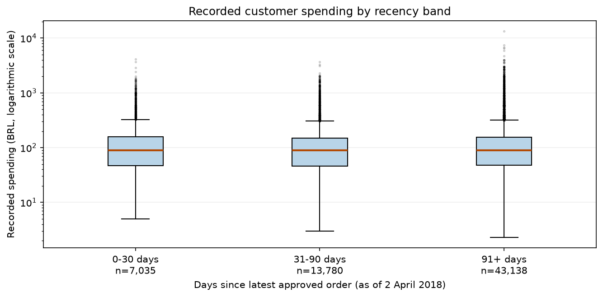
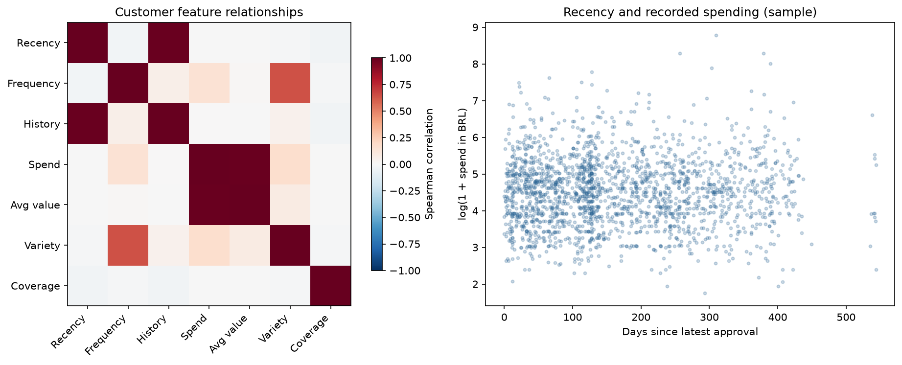
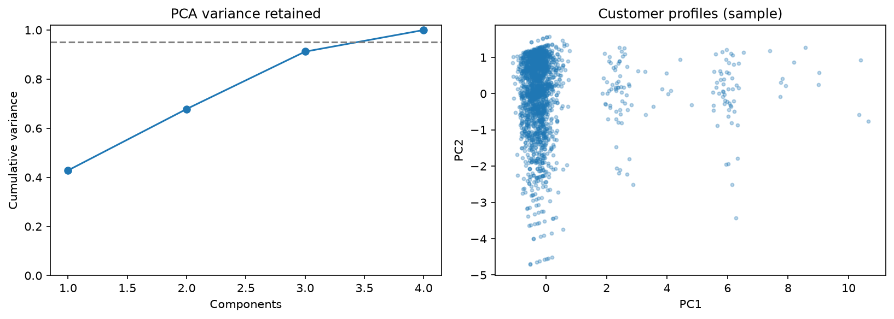
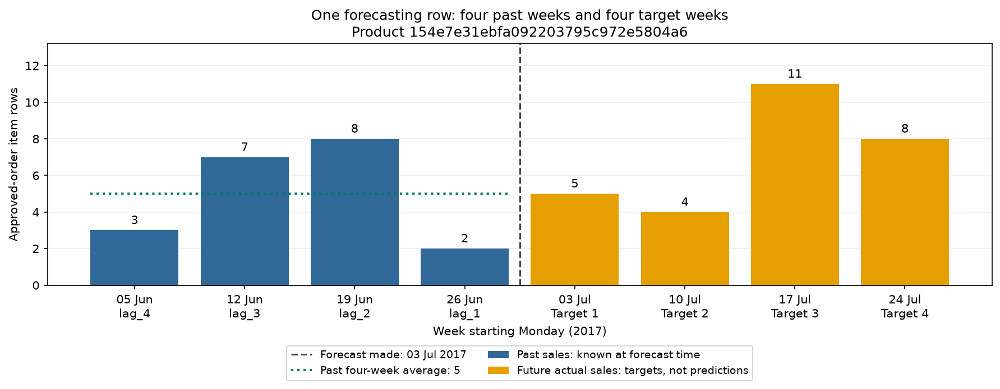
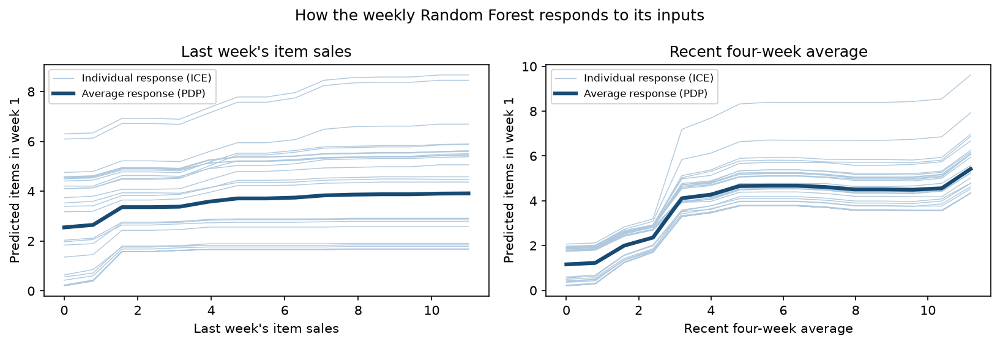
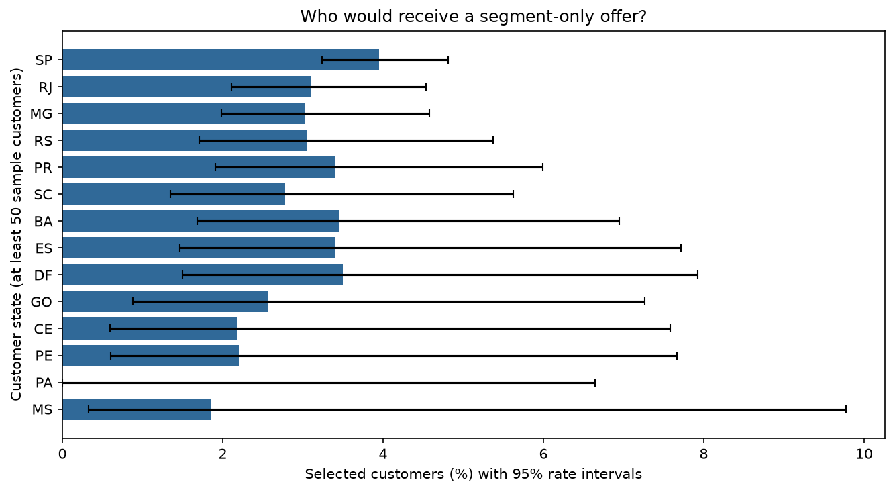

# Final report

This report summarizes the executed Olist capstone: problem framing, data, EDA and feature engineering, model results, fairness, and business recommendations. Reproducible code is in the [single notebook](../notebooks/Final_Project.ipynb) and [source modules](../src/olist_analytics/); both audience-specific decks are in [presentations](../presentations/README.md).

## Executive summary

Customer segmentation identifies two broad purchasing groups, but the larger single-order group generates most recorded sample spending. Weekly and daily Random Forest experiments do not outperform their simple benchmarks overall. The daily experiment also misses all five observed trend labels. The project therefore supports further customer research and better data collection, rather than automated marketing or inventory decisions. Financial returns are scenario assumptions, not measured benefits.

## 1. Business problem and success measures

The business questions are: **which purchasing patterns distinguish customer groups, and how well can historical sales predict future product activity?** Customer segmentation is an unsupervised clustering task; sales forecasting is regression. Repeat-purchase classification was dropped after the data review because repeat observations were limited; repeats remain part of descriptive analysis.

For segmentation, assess silhouette in a common feature space, coverage, segment size and resampling stability. For forecasting, use chronological validation and test mean absolute error (MAE), compared with simple historical benchmarks. Business priorities are understandable customer profiles and better planning accuracy. Campaign uplift, revenue gains and inventory savings require evidence from a future intervention; this dataset does not demonstrate them.

## 2. Data collection and understanding

The source is Olist's Brazilian eCommerce dataset, pinned to Kaggle version 2. Nine CSVs are preserved locally and verified with recorded checksums. The raw tables contain 99,441 orders, 96,096 persistent customers and 112,650 order-item rows. The focused analysis joins orders, customers and items; product/category and state information support interpretation. See [data provenance](../docs/DATA_MANIFEST.json) and the full data dictionary in notebook Step 2.

| Field | Type and unit | Meaning |
| --- | --- | --- |
| `order_id`, `order_item_id` | Identifier and positive integer | Together identify an order-item row |
| `customer_id` | Identifier | Joins each order to its customer record |
| `customer_unique_id` | Identifier | Connects purchases by the same recorded customer |
| `product_id` | Identifier | Identifies the product; not a forecast predictor |
| `order_approved_at` | Timestamp | Historical approval event used for timing |
| `price` | Numeric, BRL | Item price, excluding freight |

Approval is not proof of delivery or final payment settlement. Multiple item rows can belong to one order; repeat frequency counts distinct orders per persistent customer. Customer histories are limited to the observed period, so a single order does not establish permanent churn.

## EDA + Feature Engineering Report

**Purpose:** prepare customer segmentation and product-sales forecasting data. Repeat purchases remain descriptive EDA; repeat-purchase classification is retired. The executable analysis and detailed justifications are in [notebook Step 2](../notebooks/Final_Project.ipynb#step-2) and [Step 3](../notebooks/Final_Project.ipynb#step-3).

### 3.1 Connect and clean the data

Use the Olist orders, customers and order-items tables, preserved in [the source manifest](../docs/DATA_MANIFEST.json). Join orders to customers using `customer_id`, then join items using `order_id`. Validated joins prevent accidental row multiplication. Use `customer_unique_id` to recognize the same person across orders.

| Cleaning decision | Verified result and reason |
| --- | --- |
| Remove missing required fields and exact duplicates | Removed 160 orders without approval dates; no exact duplicate rows in the selected tables. Approval time defines the event being counted. |
| Check positive prices and valid item sequence numbers | No additional item rows failed these checks. |
| Consolidate at item level | 112,635 item rows; 15 items lacked a usable approved order. One item row is not one distinct purchase. |
| Retain the separate order table | 629 approved orders lack item details. They still count toward customer frequency; missing spending stays unknown. |
| Apply price outlier filtering to EDA only | Before 2 April 2018, the 1.5 × IQR rule excludes 5,648 of 75,407 item rows from the typical-price view. Valid expensive purchases remain in modeling history. |

The IQR price limits are BRL −101.25 and 275.15. A statistical outlier is not automatically a data error. Approval also does not prove delivery, and item prices exclude freight. **Code:** notebook §§2.1–2.5.

### 3.2 What the EDA shows

The customer snapshot contains **64,494 customers**, using orders approved before **2 April 2018**.

| Recorded order group | Customers | Share | Median recorded spending |
| --- | ---: | ---: | ---: |
| One order | 62,556 | 97.00% | BRL 85.90 |
| Two orders | 1,789 | 2.77% | BRL 174.40 |
| Three or more orders | 149 | 0.23% | BRL 280.29 |

Most customers have one observed order, but this does not establish permanent churn. Customers first seen near the cutoff have less time to return. Spending naturally accumulates with more orders, so the table does not demonstrate a causal benefit from encouraging another purchase.

Spending distributions overlap across recency bands: their medians are BRL 89.90, 89.00 and 89.00. **Recency alone does not clearly distinguish spending levels.** The price-only EDA view has a median item price of BRL 68.90 after filtering; this differs from total customer spending. **Code:** notebook §2.6 and §3.2.



*Figure 3.1 — Spending by recency band (notebook §3.2).* The boxes overlap and their medians are similar. Being a more recent customer does not clearly separate spending levels. The vertical axis is logarithmic; customers with unknown spending are excluded from this chart.

### 3.3 Engineer and select customer features

Create one row per customer from their pre-cutoff history. Retain these four clustering inputs:

| Feature | Definition | Why it matters |
| --- | --- | --- |
| `recency_days` | Days since the latest recorded approval | Recent versus older activity |
| `order_frequency` | Number of distinct approved orders | Purchasing frequency without counting items as orders |
| `observed_spend` | Sum of available item prices, in BRL | Recorded spending level |
| `product_variety` | Number of distinct purchased products | Breadth of purchasing |

A **filter-based selection method** removes a later candidate when its absolute Spearman correlation with an already retained feature exceeds **0.90**. It drops `avg_order_value`, which overlaps with spending, and `history_days`, which overlaps with recency. The threshold and feature priority are explicit choices, not optimized results.

`recency_band` bins recency into 0–30, 31–90 and 91+ days for readable EDA. Coverage indicators remain available for quality checks, but are excluded from clustering. No categorical encoding is needed for the four numeric inputs. **Code:** notebook §§3.1–3.3; [selection results](../artifacts/step3_bc/feature_selection.csv).



*Figure 3.2 — Relationships behind feature selection (notebook §3.2).* The heatmap shows strong overlap between history and recency, and between average order value and spending. This supports removing redundant inputs. The scatter plot shows 2,000 sampled customers and no clear spending pattern by recency. Correlation does not establish causation.

### 3.4 Handle missing values, scale and assess PCA

There are **541 customers** with unknown spending and product variety. Retain these customers and use median imputation for model inputs. Original profiles keep their missingness so imputed amounts are not reported as observed spending.

The preparation pipeline applies **median imputation → `log1p` → standard scaling**. This reduces skew and stops currency amounts from dominating day/count features. Fit on the development snapshot for descriptive analysis; Step 4 refits preparation within its clustering sample and stability subsets. No unseen-customer performance is claimed.

PCA at a **95% variance target retains all four components**, so it provides no further compression. The two-component view retains **67.8%** of variance and is used for visualization and an explicit reduced-model comparison. Step 4 finds no common-sample silhouette advantage over the selected four-feature K-Means model. **Code:** notebook §§3.4–3.5 and §§4.1–4.3; [PCA figure](figures/03_pca.png).



*Figure 3.3 — What PCA preserves (notebook §3.5).* Four components are needed to reach the dashed 95% line. The two-dimensional customer view retains 67.8% of variance; visible groups are exploratory patterns, not validated customer segments.

### 3.5 Engineer weekly sales features

Select five products using **2 January–2 July 2017** sales: require at least eight active weeks, then rank by item count. Create every product-week, including weeks with zero recorded sales.

| Input or target | Construction and justification |
| --- | --- |
| `lag_1` to `lag_4` | Item counts in the four completed weeks before the forecast date |
| `mean_last_4` | Average of those four past weeks; shift before rolling to avoid using the current outcome |
| `target_week_1` to `target_week_4` | Counts in the forecast-origin week and following three weeks; never model inputs |

Remove rows without complete history or target windows. This produces **180 development rows across five products**. All four targets finish before 2 April 2018. Later model validation also requires training outcomes to finish before each scoring date. Product IDs identify rows; they are not numeric predictors. **Code:** notebook §3.6.



*Figure 3.4 — Keep past inputs separate from future outcomes (notebook §3.6).* Blue bars supply the four lag features and their average. Orange bars are the actual future outcomes used as targets, not predictions or model inputs. The dashed line marks the forecast date.

Zero recorded sales do not prove zero demand or product availability. Results concern these five products, not the entire catalogue. The later calendar-only daily experiment in §4.9 uses its own training-selected product set.

### 3.6 Reproduce the analysis and trace the outputs

Run these commands from the repository root with the environment and Olist files prepared as described in the README:

```powershell
.venv\Scripts\python.exe scripts/download_olist.py --verify-only
.venv\Scripts\python.exe scripts/run_notebook.py
.venv\Scripts\python.exe scripts/check_notebooks.py "notebooks/Final_Project.ipynb"
```

The runner executes the **single notebook in a fresh kernel**, including the preprocessing and assertions. The final command checks structure and stored errors only. Setup and dependencies are documented in [README](../README.md) and [requirements.txt](../requirements.txt); a fresh Windows/Python 3.13 environment passed all 36 code cells and targeted checks on 24 September 2026 using checksum-verified local data.

Notebook §3.7 saves [customer profiles](../data/processed/customer_profiles.csv), [scaled features](../data/processed/customer_features_scaled.csv), [PCA features](../data/processed/customer_features_pca.csv), [weekly features](../data/processed/product_week_features.csv), fitted preparation and [configuration](../artifacts/step3_bc/configuration.json). Reload checks confirm the saved transformations reproduce their results. Generated data and binary artifacts may need regeneration in a fresh checkout.

**Later explainability evidence:** notebook §4.7 uses validation permutation importance; §5.1 provides PDP/ICE plots. Recent average sales and last week's sales are influential inputs, with correlated-feature limitations. See the following Bias & Fairness Analysis for interpretation. The most recent full notebook run passed all 36 code cells; adding this report section does not change the computations.

## 4. Model implementation and results

### 4.1 Customer segmentation

K-Means and DBSCAN were compared using selected features and a two-component PCA representation. The selected model is **K-Means with two clusters and four features**: recency, order frequency, recorded spending and product variety. It uses 6,000 sampled historical customers. Common-sample silhouette is **0.741**; PCA K-Means ties that score, while the DBSCAN finalist scores **0.602**. Resampling agreement is high, but this describes the available sample rather than guaranteeing future segmentation quality.

| Segment | Customers | Median recorded spend | Share of recorded sample spend |
| --- | --- | --- | --- |
| Single-order customers | 5,800 (96.7%) | BRL 84.99 | 93.8% |
| Repeat or broader-basket customers | 200 (3.3%) | BRL 176.95 | 6.2% |

The small group is more active: 89% have multiple orders and 90% have multiple products. The large group still accounts for most spending and should not be overlooked. Investigating first-purchase experience or product bundles is a proposed next action, not an intervention whose benefit has been demonstrated. See [segment evidence](tables/04_customer_business_profiles.csv).

### 4.2 Weekly sales forecasting

Five products were selected using early training history. Decision Tree and Random Forest use four sales lags and a trailing four-week mean to predict the next four weeks. Three chronological validation folds choose settings; final training uses 180 mature product-origin rows before 2 April 2018. The later comparison covers 65 product-origin rows, or 260 weekly predictions, with outcomes ending before 23 July 2018.

| Method | Test MAE, items | Role |
| --- | --- | --- |
| Last week | 0.869 | Benchmark |
| Four-week mean | 0.894 | Business comparison benchmark |
| Random Forest | 1.021 | Selected ML candidate |
| Decision Tree | 1.097 | ML comparison |

Lower MAE is better. Random Forest is best among the tested ML candidates but has **14.2% higher error** than the four-week mean. The ML-only choice policy was requested after earlier test results had been viewed; no new untouched-test claim is made. Keep the benchmark and human review for planning. See [model comparison](tables/04_forecast_test_comparison.csv).

### 4.3 Daily product trends

The daily extension fits a calendar-only Random Forest for each of the five products ranked using 2017 training sales. It trains on 2 January-31 December 2017, tunes on 1 January-1 April 2018, then refits before evaluating 2 April-22 July. Inputs are elapsed day, month, day of month and day of week; there are no sales lags.

Test MAE is **0.850 items/day**, compared with **0.817** for the fixed pre-test average benchmark. Trend labels compare the final and first 28-day averages, using a fixed +/-0.1 items/day flat band. Predicted labels match **0 of 5** observed directions. Calendar-only trees therefore do not provide reliable upward/downward trend detection here. Daily and weekly product lists differ; consult the [product IDs and trend results](tables/04_daily_trends.csv).

<!-- BEGIN GENERATED BIAS AUDIT -->

## Bias & Fairness Analysis

**Question:** what have the models learned, where do they fail, and who could be overlooked?

### 5.1 Explain the predictions

For the weekly Random Forest, **PDP** shows the average response when we change one input; **ICE** shows individual product-date responses. Dark lines are the average; pale lines show examples. We explain week 1 using development data, without retraining.

The sales lags and their average are linked. Changing one alone can create unrealistic combinations, so these plots explain model behaviour, not what causes sales. [PDP/ICE method](https://scikit-learn.org/stable/modules/partial_dependence.html)

For clustering, the original profiles in 4.4 provide the explanation: spending, frequency, recency, and product variety distinguish the groups. A segment is not a measure of a person's worth.

| feature | first_prediction | last_prediction |
| --- | --- | --- |
| lag_1 | 2.550 | 3.916 |
| mean_last_4 | 1.162 | 5.421 |



### 5.2 Where can the models mislead us?

| Limitation | What it means here |
| --- | --- |
| Imbalance | Most customers ordered once; many product-days have zero recorded sales. An overall score can hide poor results on busy days. |
| Leakage | Products and settings are selected before testing. Weekly labels finish before each scoring period; daily inputs use only calendar information. Previously viewed test dates are disclosed. |
| Overfitting and change over time | Training error can be optimistic. Compare it with chronological validation/test error below; different sales periods also affect the gap. |
| Limited scope | Clusters describe a 6,000-customer sample. Forecasts cover five products, not the whole catalogue. |
| Weak predictive value | Both Random Forest versions trail their average benchmarks overall; daily trend labels matched 0/5 products. |
| Missing context | Stock availability and promotions are unknown. Recorded approved items are not guaranteed deliveries or unconstrained demand. |

Training error is measured on each final model's fitted rows; daily models were refitted on train + validation. Weekly and daily errors have different units. In the second table, **positive bias means overprediction**. Weekly forecast windows overlap.

| Model | Unit | Training MAE | Validation MAE | Test MAE |
| --- | --- | --- | --- | --- |
| Random forest 2 | items / product-week | 1.720 | 1.996 | 1.021 |
| Decision tree 2 | items / product-week | 1.886 | 2.110 | 1.097 |
| Daily Random Forest | items / product-day | 0.615 | 1.017 | 0.850 |

| Model | Sales period | Forecasts | Share (%) | MAE | Bias |
| --- | --- | --- | --- | --- | --- |
| Weekly RF | Positive sales | 77 | 29.615 | 2.020 | -1.182 |
| Weekly RF | Zero sales | 183 | 70.385 | 0.601 | 0.601 |
| Daily RF | Positive sales | 155 | 27.679 | 1.139 | -1.074 |
| Daily RF | Zero sales | 405 | 72.321 | 0.740 | 0.740 |

**Finding:** about 70% of weekly targets and 72% of daily targets record zero sales. On positive-sales periods, both models underpredict on average. The daily model also has lower training error (0.615) than validation error (1.017): fitting past observations well has not translated into reliable forecasts.

### 5.3 Which groups can we audit?

Olist has no direct gender, race, age, or income fields. **We cannot claim fairness across these groups.** State and spending must not be used to guess protected attributes or socioeconomic status.

| Attribute | Available | Use |
| --- | --- | --- |
| Gender | No | Cannot audit; do not infer |
| Race | No | Cannot audit; do not infer |
| Age | No | Cannot audit; do not infer |
| Income / socioeconomic status | No | Cannot audit; do not infer |
| Customer state | Yes | Geographic comparison only |

### 5.4 Could a segment-only offer overlook some locations?

**Hypothetical scenario:** only customers in the cluster with higher median spending receive an offer. No offers are sent. We compare selection rates by each customer's latest recorded state before the segmentation cutoff.

- **Parity gap:** highest minus lowest state selection rate; closer to 0 means more equal coverage.
- **Selection-rate ratio:** lowest divided by highest rate; closer to 1 means more equal coverage. This uses the disparate-impact ratio idea, without claiming legal compliance.

Compare states with at least **50 sampled customers**; save all state counts separately. Error bars show 95% intervals for individual rates. Small selected counts still make comparisons uncertain.

This is a **geographic disparity check**, not a substitute for sensitive-group fairness. Equalised odds cannot be calculated meaningfully: we have no true eligibility/benefit outcome for the hypothetical offer. Forecast-error differences across products or sales activity are also not protected-group fairness metrics. [Metric definitions](https://fairlearn.org/main/user_guide/assessment/common_fairness_metrics.html)

| customer_state | customers | selected | selection_rate | lower_95 | upper_95 | included_in_gap |
| --- | --- | --- | --- | --- | --- | --- |
| SP | 2380 | 94 | 0.040 | 0.032 | 0.048 | True |
| RJ | 807 | 25 | 0.031 | 0.021 | 0.045 | True |
| MG | 694 | 21 | 0.030 | 0.020 | 0.046 | True |
| RS | 361 | 11 | 0.030 | 0.017 | 0.054 | True |
| PR | 323 | 11 | 0.034 | 0.019 | 0.060 | True |
| SC | 252 | 7 | 0.028 | 0.013 | 0.056 | True |
| BA | 203 | 7 | 0.035 | 0.017 | 0.070 | True |
| ES | 147 | 5 | 0.034 | 0.015 | 0.077 | True |
| DF | 143 | 5 | 0.035 | 0.015 | 0.079 | True |
| GO | 117 | 3 | 0.026 | 0.009 | 0.073 | True |
| CE | 92 | 2 | 0.022 | 0.006 | 0.076 | True |
| PE | 91 | 2 | 0.022 | 0.006 | 0.077 | True |
| PA | 54 | 0 | 0.000 | 0.000 | 0.066 | True |
| MS | 54 | 1 | 0.018 | 0.003 | 0.098 | True |
| MA | 48 | 1 | 0.021 | 0.004 | 0.109 | False |
| MT | 47 | 3 | 0.064 | 0.022 | 0.172 | False |
| PB | 37 | 0 | 0.000 | 0.000 | 0.094 | False |
| RN | 35 | 0 | 0.000 | 0.000 | 0.099 | False |
| PI | 26 | 2 | 0.077 | 0.021 | 0.241 | False |
| AL | 25 | 0 | 0.000 | 0.000 | 0.133 | False |
| SE | 18 | 0 | 0.000 | 0.000 | 0.176 | False |
| TO | 12 | 0 | 0.000 | 0.000 | 0.242 | False |
| RO | 12 | 0 | 0.000 | 0.000 | 0.242 | False |
| AM | 10 | 0 | 0.000 | 0.000 | 0.278 | False |
| AC | 5 | 0 | 0.000 | 0.000 | 0.434 | False |
| AP | 5 | 0 | 0.000 | 0.000 | 0.434 | False |
| RR | 2 | 0 | 0.000 | 0.000 | 0.658 | False |

Geographic rate gap: **3.95 percentage points**. Min/max selection ratio: **0.00**. Coverage: 5,718/6,000 customers across 14 states; unknown: 0.



**Finding:** the state rate gap is **3.95 percentage points**, with a ratio of **0.00**. This is driven by PA having **0/54** selected customers, versus SP at **94/2,380**. PA's rate interval extends to about 6.64%, so zero in this sample does not establish zero opportunity in the population. The intervals also omit uncertainty from fitting and choosing the clusters. Investigate coverage before using segments to allocate offers.

### 5.5 Mitigations and decision

| Risk | Proposed action | How to check it |
| --- | --- | --- |
| Segment-only offers exclude customers | Keep basic service available to everyone; test inclusive outreach beyond the higher-spend segment. | Compare group reach and measured campaign benefit in an approved pilot. |
| Sparse groups or sales activity | Collect more representative real observations; test training-only reweighting if justified. Do not invent demographic labels or sales. | Recheck subgroup errors, sample sizes, and uncertainty on new dates. |
| Unreliable forecasts | Keep human review and the simple benchmark; test improvements using new validation dates. | Require improved error and trend agreement before operational use. |
| Missing sensitive attributes | If appropriate, obtain voluntarily supplied attributes with consent, restricted access, and a clear audit purpose. | Then assess protected-group selection rates and, with valid outcomes, equalised odds. |
| Unequal decision thresholds | If a real classifier or offer score is introduced, evaluate thresholds/post-processing on validation data. | Assess fairness and utility together; do not tune to this inspected test period. |

**Decision:** useful exploratory analysis, but insufficient evidence for automated offers or stocking decisions. Geographic differences warrant investigation; they do not establish discrimination. Proposed mitigations have not been deployed or shown to work. Only aggregate audit results are exported; protected-group coverage remains an explicit project gap.

<!-- END GENERATED BIAS AUDIT -->


## 6. Business recommendations and communication

Use segmentation to organize customer research, with attention to both groups. Examine the first-purchase experience and buying combinations before proposing an offer. Measure any actual initiative against a suitable control group; the present data do not identify causal campaign effects.

Keep simple forecasting benchmarks and human review. Collect better product availability, promotion and stock information; assess improvements on new dates before relying on forecasts for inventory. Do not mistake missing sales for zero demand.

The technical and business presentations each contain 10 slides. Their proposed customer pilot is a future experiment. The illustrative business scenario assumes 1,000 contacts, BRL 40 contribution per incremental order and BRL 1,500 total cost. Break-even requires at least 38 extra orders. These numbers are assumptions, not Olist outcomes; see [ROI scenarios](../presentations/roi_scenarios.csv).

## 7. Reproducibility and conclusion

The repository contains one executed notebook, reusable source code, data acquisition and verification utilities, model settings, result tables, figures, this report and both decks. Raw data and fitted model binaries are regenerated locally. Follow the [README](../README.md) for environment setup and commands; [STATUS.md](../docs/STATUS.md) records verification and publication status.

The project demonstrates reproducible segmentation and forecasting comparisons, including negative findings. Customer profiles are interpretable, but forecasting accuracy and trend detection do not justify operational deployment. Sensitive-group fairness and mitigation effectiveness remain unverified. Future work needs new evaluation data and measured business outcomes.
